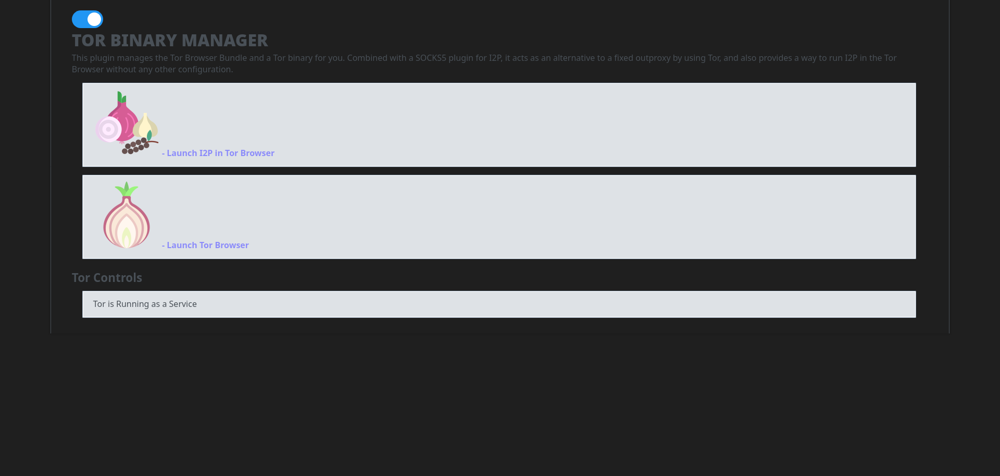

# i2p.plugins.tor-updater

A Tor package updater and runner as an I2P Plugin. This plugin is
usable on Windows and Linux for now. OSX support is planned soon.

Usage:
------

See [Usage](USAGE.md) for command-line usage.

Status:
-------


Linux: Usable, most things work.
Windows: Usable, most things work.
OSX: Unstable, untested, not usable, WIP.

Other systems are not targeted and should use a Tor binary built from source,
provided by TPO or, their prefered package management system and not this plugin.
The plugin will not start a Tor instance if a SOCKS proxy is open on port 9050.


### Primary Goals

1. Ship known-good public keys, download a current Tor for the platform in the background, authenticate it, and launch it only if necessary.
 - Works on Windows, Linux, OSX
2. Supervise Tor as a ShellService plugin to I2P
 - Works on Linux, Windows, OSX
3. Keep Tor up-to-date
 - Works on Windows, Linux, OSX
4. Work as an I2P Plugin OR as a freestanding app to be compatible with all I2P distributions
 - Works on Linux, Windows, OSX
5. Download Tor Browser from an in-I2P mirror(or one of a network of in-I2P mirrors)
 - Not done

### Secondary Goals:

1. Launch Tor Browser
 - Works on Linux, Windows, OSX with minor bugs
2. Configure and launch Tor browser for use with I2P
 - Works on Linux, Windows, OSX with minor bugs

#### Optional Features I might add if there is interest

1. Mirror the files which it downloads to an I2P Site
 - Works on Windows, Linux, OSX
2. Mirror the files which it downloads to I2P torrents
 - Not done
3. Set up an onion site which announces an I2P mirror exists
 - Not done
4. Use Bittorrent-over-I2P to download the Tor Browser software
 - Not Done

### Usage as a Library

[More information at the GoDoc](https://pkg.go.dev/i2pgit.org/idk/i2p.plugins.tor-manager)

This is also useful as a library for downloading a Tor Browser Bundle. This API
isn't really stable, more "stabilizing." Feel free to use it, but it may still
change a little.

To create a new instance, use:

``` Go
client, err = tbserve.NewClient(*verbose, *lang, *system, *arch, &content)
```

Customize the client using the exposed variables and methods:

``` Go
client.Host = *host
client.Port = *port
client.TBS.Profile = &content
client.TBS.PassThroughArgs = flag.Args()
```

And serve the controller:

``` Go
if err := client.Serve(); err != nil {
  log.Fatal(err)
}
```

### Similar Projects:

- https://github.com/micahflee/torbrowser-launcher
- https://github.com/whonix/tb-updater

<a href="https://www.flaticon.com/free-icons/garlic" title="garlic icons">Garlic icons created by Icongeek26 - Flaticon</a>
<a href="https://www.flaticon.com/free-icons/onion" title="onion icons">Onion icons created by Freepik - Flaticon</a>

### More Screenshots:

- 
- 
