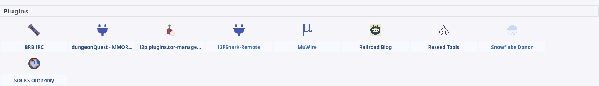
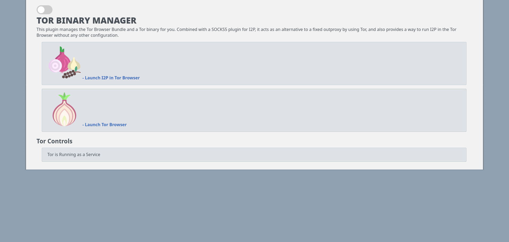

# i2p.plugins.tor-updater

A Tor package updater and runner as an I2P Plugin. This plugin is
usable on Windows, Linux, and OSX, as is the freestanding binary.
This also functions as a freestanding update for the Tor Browser
Bundle and is capable of configuring Tor Browser from the terminal
and updating it without running it, should the user choose to operate
this way.

This project explicitly views I2P and Tor as complementary privacy
tools and explores good ways of combining them in a user-facing tool.
It is especially useful when combined with a SOCKS Outproxy plugin
like the one written by zzz. You can obtain it within I2P: http://zzz.i2p/topics/3219

Usage:
------

See [Usage](USAGE.md) for command-line usage. When used from the Terminal,
it acts as a cross-platform Tor Browser installer and wrapper, which adds
non-Tor specific options.

[HTML version](usage.html)

Plugin:
-------

Clearnet visitor? You'll need to use the [Github Releases Mirror](https://github.com/eyedeekay/i2p.plugins.tor-manager/releases/0.0.14).

- [i2p.plugins.tor-manager-linux-386](i2p.plugins.tor-manager-linux-386.su3)
- [i2p.plugins.tor-manager-windows-amd64](i2p.plugins.tor-manager-windows-amd64.su3)
- [i2p.plugins.tor-manager-darwin-arm64](i2p.plugins.tor-manager-darwin-arm64.su3)
- [i2p.plugins.tor-manager-linux-amd64](i2p.plugins.tor-manager-linux-amd64.su3)
- [i2p.plugins.tor-manager-windows-386](i2p.plugins.tor-manager-windows-386.su3)
- [i2p.plugins.tor-manager-darwin-amd64](i2p.plugins.tor-manager-darwin-amd64.su3)


Status:
-------



Linux: Usable, everything implemented works.
Windows: Usable, everything implemented works.
OSX: Usable, everything implemented works.

Other systems are not targeted and should use a Tor binary built from source,
provided by TPO or, their prefered package management system and not this plugin.
The plugin will not start a Tor instance if a SOCKS proxy is open on port 9050.


### Primary Goals(Done):

1. Ship known-good public keys, download a current Tor for the platform in the background, authenticate it, and launch it only if necessary.
 - Works on Windows, Linux, OSX
2. Supervise Tor as a ShellService plugin to I2P
 - Works on Linux, Windows, OSX
3. Keep Tor up-to-date
 - Works on Windows, Linux, OSX
4. Work as an I2P Plugin OR as a freestanding app to be compatible with all I2P distributions
 - Works on Linux, Windows, OSX
5. Download Tor Browser from an in-I2P mirror(or one of a network of in-I2P mirrors)
 - Works on Linux, Windows, OSX

### Secondary Goals(Also done):

1. Launch Tor Browser
 - Works on Linux, Windows, OSX
2. Configure and launch Tor browser for use with I2P
 - Works on Linux, Windows, OSX

#### Optional Features I might add if there is interest(Not much stopping me...):

1. Mirror the files which it downloads to an I2P Site
 - Works on Windows, Linux, OSX
2. Mirror the files which it downloads to I2P torrents
 - Works on Windows and Linux, might work on OSX but unsure.
3. Set up an onion site which announces an I2P mirror exists
 - Works on Windows, Linux, OSX
4. Use Bittorrent-over-I2P to download the Tor Browser software
 - Worksish. Still a little janky. Usable on any platform if you're a little patient.
5. Embed jpackaged I2P routers and manage them internally
 - Works on Windows and Linux. Can be done on OSX but needs to be different. AMD64 only.
6. Encrypt the "Working directory" with all the plugin data using a password.
 - Works on Windows, Linux, and OSX.
7. Use a transparently encrypted filesystem to interact with the host system.
 - Not done.
8. Option to use BRB in a thread as an in-I2P replacement for `mibbit` IRC client.
 - Works on Windows, Linux, OSX

### Usage as a Library

[More information at the GoDoc](https://pkg.go.dev/i2pgit.org/idk/i2p.plugins.tor-manager)

This is also useful as a library for downloading a Tor Browser Bundle. This API
isn't really stable, more "stabilizing." Feel free to use it, but it may still
change a little.

To create a new instance, use:

``` Go
client, err = tbserve.NewClient(*verbose, *lang, *system, *arch, &content)
```

Customize the client using the exposed variables and methods:

``` Go
client.Host = *host
client.Port = *port
client.TBS.Profile = &content
client.TBS.PassThroughArgs = flag.Args()
```

And serve the controller:

``` Go
if err := client.Serve(); err != nil {
  log.Fatal(err)
}
```

### Similar Projects:

- [https://github.com/micahflee/torbrowser-launcher](https://github.com/micahflee/torbrowser-launcher)
- [https://github.com/whonix/tb-updater](https://github.com/whonix/tb-updater)
- Probably about 200 or so bespoke scripts written and abandoned by hackers over the years, search github

#### Why this is Better than those projects(A.K.A Why didn't you just use...)

##### [TorBrowser Launcher](https://github.com/micahfleee/torbrowser-launcher)

i2p.plugins.tor-manager is in many ways a clone of Tor Browser Launcher by Micah Lee,
it reproduces all of TBL's functionality for downloading, verifying, and running
Tor Browser. In particular Micah's project deserves credit for the AppArmor profiles,
which were used in the apparmor profile generator functionality and will probably
continue to be the upstream example which I use in my code. Micah's also already got
a PPA, a FlatPak, a Snap, an `.rpm` and a bunch of other stuff that provides, through
packaging, a better way to deal with updates to his software and a better way to deal
with the supply chain for many users. There is no reason that `i2p.plugins.tor-manager`
cannot do this, in fact it's easier for us than it is for Micah, but this project is
about a month and a half old and his is several years old. I haven't done a bunch of
packages yet.

Improvements on Tor Browser Launcher include:

 - Does not require GPG to be in the `$PATH` or on the system at all
 - Capable of managing a long-running Tor service without also running the Tor Browser
 - Works everywhere Tor Browser does, not just Linux. Including:
  Linux, Mac, Windows, AMD64, X86, and M1
 - Embeds all required resources into a single binary which unpacks itself to a directory
  of the user's choice. Never touches any other directory(in ~/.cache or ~/.local, etc),
  unless specifically instructed to.
 - Easy to package by placing a single static binary into a boilerplate package.
 - Automatically generate an AppArmor profile which works for custom installation directory
 - Accepts a custom profile argument without interfering with normal Tor Browser
  functionality.
 - Bundles a "Extra" profiles for I2P browsing, non-Anonymous browsing, and
  offline/localhost-only browsing.
 - Automatically organize multiple Tor Browser profiles for different networks(I2P,
  Clearnet) and discourage accidental mixing.
 - Optional TAILS mode, adds uBlock Origin to Tor Browser
 - Embeds an I2P router in case the host system doesn't have an I2P router
 - Encrypt the working directory automatically when it's not in use.
 - No python. Language wars are stupid, but so is python.

Things Tor Browser Launcher does that this does not(yet):

 - Micah went to far greater effort to assure that TPO's HTTPS certificate was
 authentic and avoid the Certificate Authority/PKI system. As a result, CA's are
 untrusted entities when downloading from the default Tor Project site. This is
 probably a pretty good idea.
 - This application does not offer a choice of downloading Tor Browser over the
 clearnet if there is literally any other option available to it. This is roughly equivalent
 to downloading Tor Browser over system Tor being always on in Tor Browser Launcher.
 - This application does not play dial-up noises.

#### [TB-Updater(Whonix)](https://github.com/whonix/tb-updater)

tb-updater is generally only useful on Linux systems and especially Debian-based systems,
and only recieves serious testing within the Whonix system itself. It's a highly specialized
tool in some ways, depending on packages which must be installed and repositories which must
be configured. For their purposes, this is probably a good thing, Whonix's raison d'etre is
to carefully configure every aspect of their system to be as anonymous and secure as possible,
and their approach deals with supply-chain issues which `i2p.plugins.tor-manager` can only
deal with in **packaging** and not by adding features to the launcher itself. Therefore, while
most of the improvements on Tor Browser Launcher also apply to TB-Updater, the
`i2p.plugins.tor-manager` and `tb-launcher` are actually less directly comparable.

<a href="https://www.flaticon.com/free-icons/garlic" title="garlic icons">Garlic icons created by Icongeek26 - Flaticon</a>
<a href="https://www.flaticon.com/free-icons/onion" title="onion icons">Onion icons created by Freepik - Flaticon</a>
<a href="https://www.flaticon.com/free-icons/search" title="search icons">Search icons created by Freepik - Flaticon</a>
<a href="https://www.flaticon.com/free-icons/offline" title="offline icons">Offline icons created by Flat Icons - Flaticon</a>

### More Screenshots:

- 
- 
